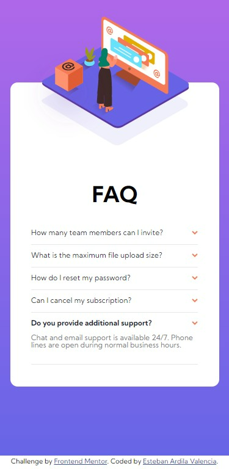
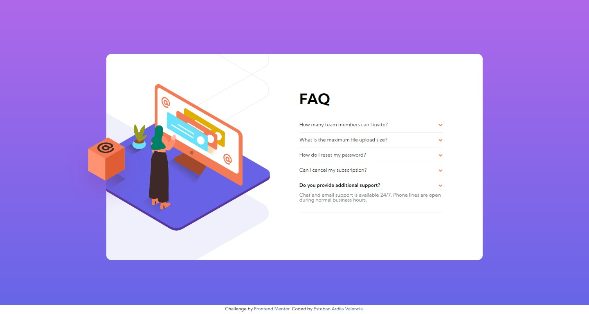

# Frontend Mentor - FAQ accordion card solution

This is a solution to the [FAQ accordion card challenge on Frontend Mentor](https://www.frontendmentor.io/challenges/faq-accordion-card-XlyjD0Oam). Frontend Mentor challenges help you improve your coding skills by building realistic projects. 

## Table of contents

- [Overview](#overview)
  - [The challenge](#the-challenge)
  - [Screenshot](#screenshot)
  - [Links](#links)
- [My process](#my-process)
  - [Built with](#built-with)
  - [Useful resources](#useful-resources)
- [Author](#author)

**Note: Delete this note and update the table of contents based on what sections you keep.**

## Overview

### The challenge

Users should be able to:

- View the optimal layout for the component depending on their device's screen size
- See hover states for all interactive elements on the page
- Hide/Show the answer to a question when the question is clicked

### Screenshot

### Links

- [Solution URL](https://github.com/esardila/fm_faq_accordion_card)
- [Live Site URL](https://esardila.github.io/fm_faq_accordion_card/)

## My process

### Built with

- Semantic HTML5 markup
- CSS custom properties

### Useful resources

- [Child and Sibling Selectors](https://css-tricks.com/child-and-sibling-selectors/)
- [CSS :target](https://developer.mozilla.org/en-US/docs/Web/CSS/:target)

## Author

- [Esteban Ardila Valencia](mailto:esardila@outlook.com)
